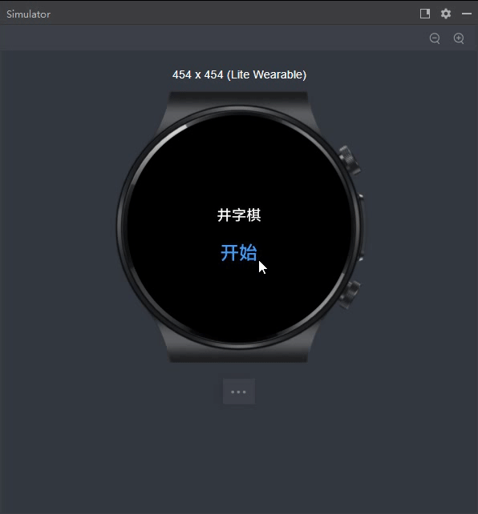

# harmony-tic-tac-toe

## 鸿蒙井字棋demo Lite Wearable设备

> [原项目地址](https://github.com/mulgokizary33/harmony-tic-tac-toe)

入口文件: entry/src

### 小优化

- 添加了关键代码的注释（思路），方便理解代码。

- 新增"死棋"逻辑判断
  
  

### 项目截图

